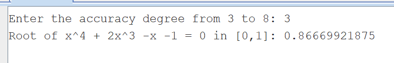
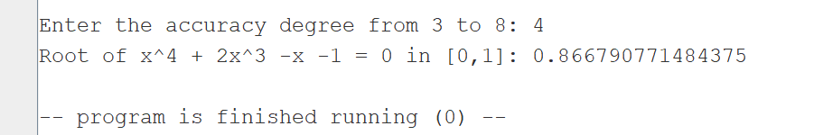
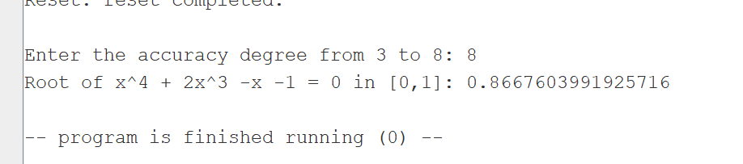
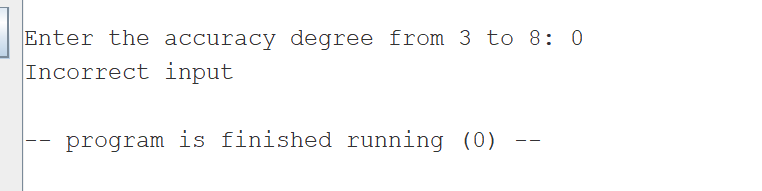
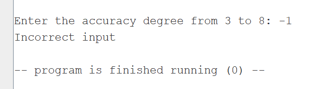
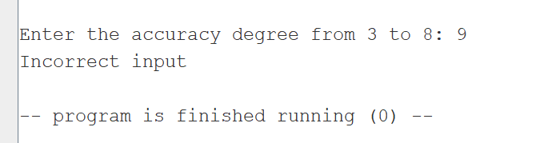
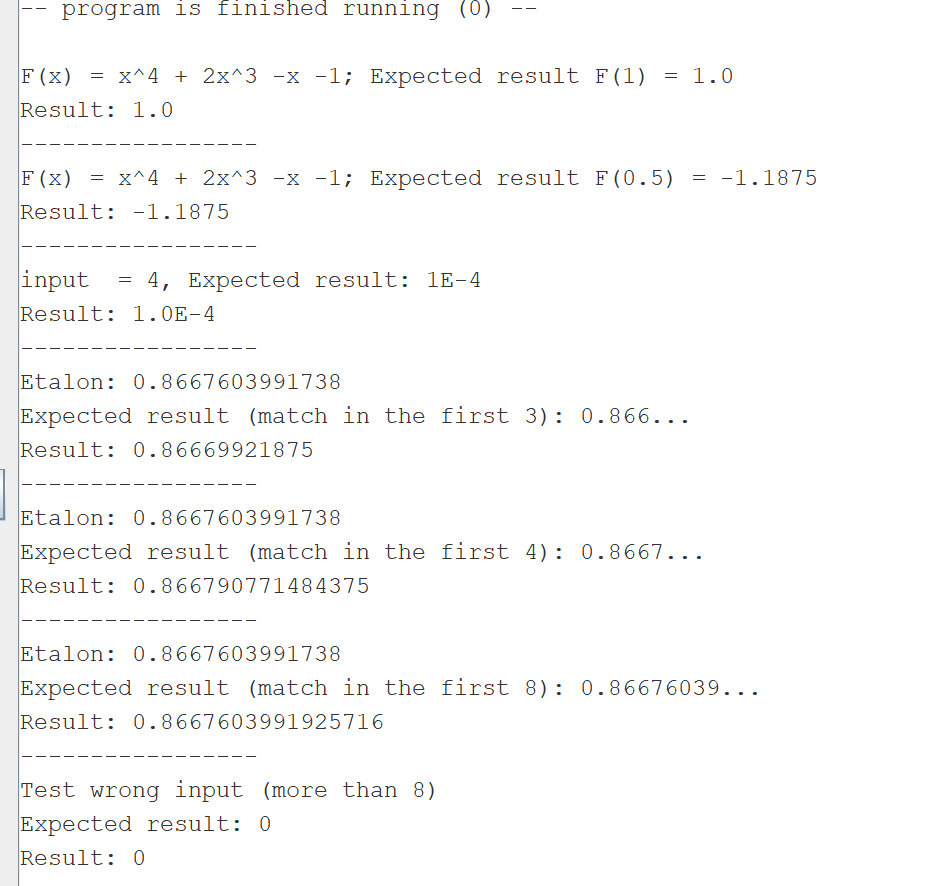
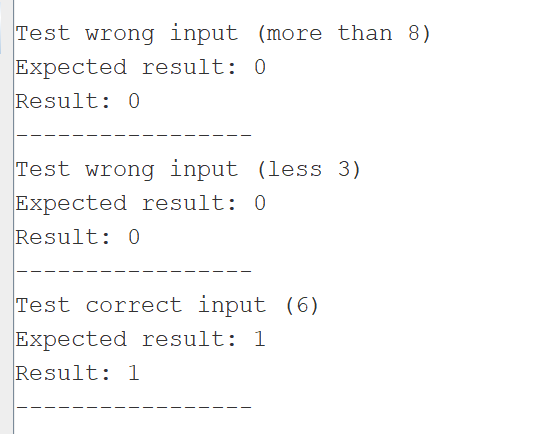
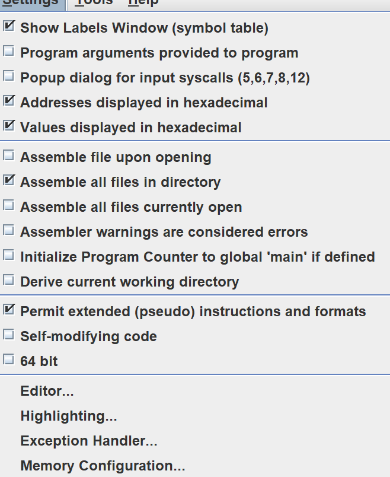
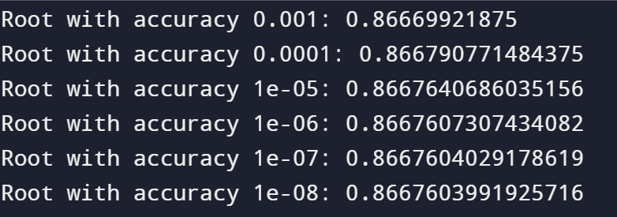

# Отчёт

__ФИО/группа:__ Ермолаева Елена Александровна БПИ224

__Вариант:__ 34

__Условие__

### Метод решения
Программа состоит из нескольких подпрограмм:

pow_accurancy: вычисляяет точность поиска корня от 0.001 (n = 3) до 0.00000001 (n=8) согласно условию, путем возведения 10 в степень n (цикла умножения 10 n раз) и делением 1/10^n

value_substitution: Функция считает f(x) = x^4 + 2x^3 -x -1, для любого x переданного через параметр как тип double (в регистре fa0)

find_solution: Основная фукнция использующая ранее описанные функции. Метод заключается в том, что первоначально рассматривается отрезок
[0, 1]. Считаются значения f(0), f(1) и f((0+1)/2 = 0.5), то есть от среднего отрезка. Очевидно что копень либо [0, 0.5], либо [0.5, 1], то есть область рассмотрения можно сузить посреедством оставления того промежутка где граничные значения разных знаков, то есть их произведение отрицательно. Это и реализвано в функции (if f(left)* f(middle) >= 0 then left = middle else right = midle). тем самым f(middle) имеет значение все более близкое к 0 и middle более близкое к корню ураавнения. Коггда длина отрезка станет меньше точности middle будет удовлетворять условиям задачи. И произойдет выход из цикла дробения отрезка.  

[Ссылка на источник с пояснением метода половинного деления](https://elib.belstu.by/handle/123456789/33282#:~:text=%D0%9C%D0%B5%D1%82%D0%BE%D0%B4%20%D0%BF%D0%BE%D0%BB%D0%BE%D0%B2%D0%B8%D0%BD%D0%BD%D0%BE%D0%B3%D0%BE%20%D0%B4%D0%B5%D0%BB%D0%B5%D0%BD%D0%B8%D1%8F%20%D1%81%D0%BE%D1%81%D1%82%D0%BE%D0%B8%D1%82%20%D0%B2,%D0%BD%D0%B5%20%D1%81%D1%82%D0%B0%D0%BD%D0%B5%D1%82%20%D0%BC%D0%B5%D0%BD%D1%8C%D1%88%D0%B5%20%D0%B7%D0%B0%D0%B4%D0%B0%D0%BD%D0%BD%D0%BE%D0%B9%20%D1%82%D0%BE%D1%87%D0%BD%D0%BE%D1%81%D1%82%D0%B8.)

__Тесты и результаты__

1. n = 3; Корень верный с точностью до 3 знаков: 0.866...

2. n = 4; Корень верный с точностью до 4 знаков: 0.8667...

3. n = 8; Корень верный с точностью до 8 знаков: 0.866760399...

4. n = 0. Ожидаемый вывод: уведомление о некорректности ввода

5. n = -1 (n < 0). Ожидаемый вывод: уведомление о некорректности ввода

6. n = 9 (n > 8). Ожидаемый вывод: уведомление о некорректности ввода
   
Рельтаты тестов программы вручную:   

1.  
 
2. 

3. 

4.  

5. 

6. 

### Результат работы автоматического тестирования из файла test.asm:

### Дополнительно:

Во все подпрограммы параметры передаются через регистры (a0, a1, fa0, fa1, fa4) согласно конвенции языка. В подпрограммах задействованы регистры временного назначения ft1 - ft11 для хранения локальных переменных. (критерий оценки 6-7). В программе нет нехватки регистрова при передачи параметров или хранении локальных переменных, не нарушая конвенции, потому стек не используется.

В каждом файле отдельной подпрограммы указано, какие параметры в нее входят и за что они отвечают. А так же через какой регистр осуществляется возвращение результата, то есть указаны соответвевияфактическим параметрам (a0, fa0). (критерий оценки 6-7)

Созданные подпрограммы обернуты в соответсвующие макросы (`check_size_(%degree), pow_accurancy_macro(%x), find_root(%x), equation(%x)`)

Подгрограммы написаны в отдельных файлах, для обеспечения независимого использования в других программах (крит на оценку 8). Автоматическое тестирование в файле test.asm показывает, что функции способны функционировать независимо.

Автоматизированное тестирование выполено в файле test.asm, соответсвующий критерию 8 (воизбежание ошибок не рекомендуется хранить его в одной папке с main при запуске)

`python_solution.py` содержит решение задачи на языке Python для дополнительной проверки корректности вычислений

Программа main и tests используют соотвествующие макросы для ввода и вывода элементов массива (`print_double` и `print_str`, а так же `read_int_a0` - для считывания числа в регистр a0). Так как макросы имеют параметры, то они способены использоваться в других программах удовлетворяя критерию оценки 9

Макросы должны быть выделены в отдельную автономную библиотеку `macros.s`

Так же во избежание ошибок в системе рекомендуется установить слудующие настройки эмулятора и запускать только main.s и test.s, которые в свою очередь будут использовать ранее написанные подпрограммы через макросы.

__Результаты вывода `python_solution.py`__

